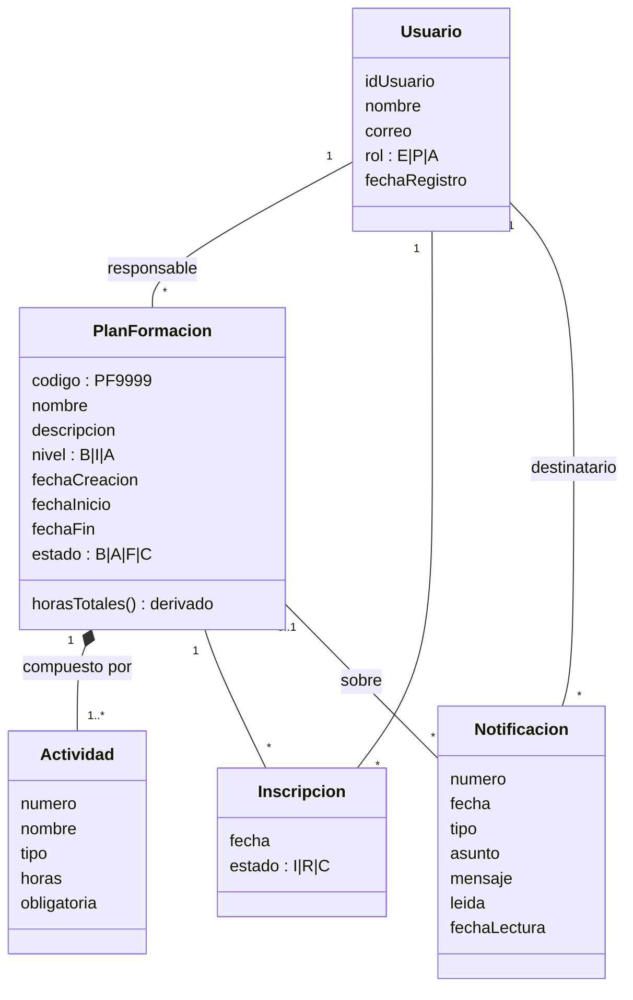
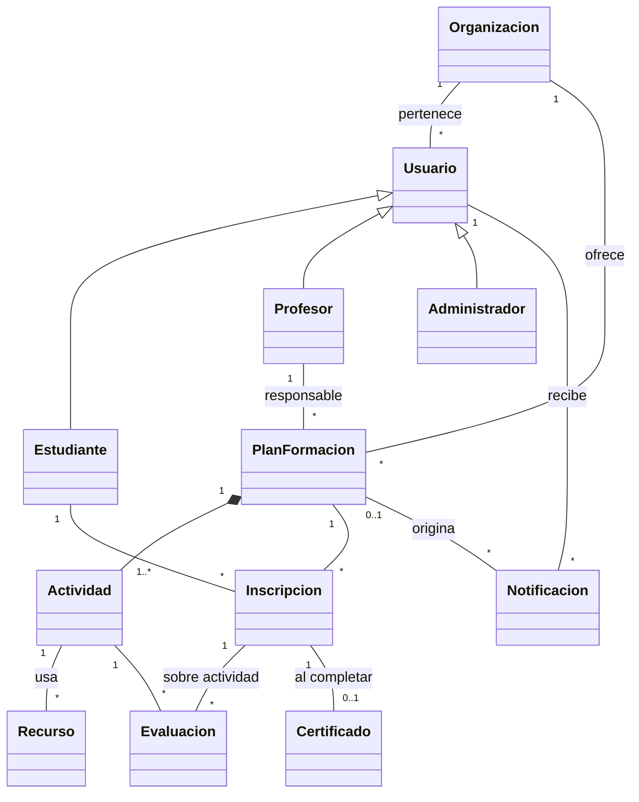

# Laboratorio 4/6 — AGISWorld: Planes de Formación + Notificaciones

**Escuela Colombiana de Ingeniería — Modelos y Servicios de Datos 2026-2**
Diseño lógico. Procedimental. SQL-DDL, SQL-DML

Integrantes: _(Apellido1 Nombre1)_ — _(Apellido2 Nombre2)_

Archivos de la entrega (en el `.zip` `ApellidoA-ApellidoB`):

| Archivo | Contenido |
|---|---|
| `lab04.pdf` | Este documento exportado a PDF |
| `AGISWorld.astah` | Diseño conceptual y lógico (se modela en Astah con base en las secciones de este documento) |
| `AGISWorld.sql` | Código completo en PostgreSQL, en un solo archivo |

---

## PARTE I. Refactorización del ciclo

### A. Diseño conceptual — cambios realizados



1. **Actividad** pasó a ser parte (composición) del plan de formación: no existe sin el plan y su número es un consecutivo dentro del plan.
2. Se agregó el **estado** del plan con su ciclo de vida (Borrador → Activo → Finalizado; Borrador/Activo → Cancelado), documentado como diagrama de estados.
3. La relación usuario–plan se separó en dos: **responsable** (profesor o administrador) e **inscripción** (clase asociación con fecha y estado).
4. Las **horas totales** del plan se marcaron como atributo **derivado** (suma de las horas de sus actividades) en lugar de almacenarse.
5. **Notificación** se relacionó con el usuario destinatario y, opcionalmente, con el plan que la originó; se añadieron `leida` y `fechaLectura`.
6. Se completó la documentación de los casos de uso *Mantener plan de formación* y *Registrar notificación* (ver Parte II).

### B. Diseño lógico — cambios realizados

```
Usuarios(idUsuario, nombre, correo, rol, fechaRegistro)
    PK: idUsuario          UK: correo
PlanesFormacion(codigo, nombre, descripcion, nivel, fechaCreacion, fechaInicio, fechaFin, estado, responsable)
    PK: codigo             UK: nombre            FK: responsable → Usuarios
Actividades(plan, numero, nombre, tipo, horas, obligatoria)
    PK: (plan, numero)     UK: (plan, nombre)    FK: plan → PlanesFormacion
Inscripciones(plan, usuario, fecha, estado)
    PK: (plan, usuario)    FK: plan → PlanesFormacion, usuario → Usuarios
Notificaciones(numero, usuario, plan, fecha, tipo, asunto, mensaje, leida, fechaLectura)
    PK: numero             FK: usuario → Usuarios, plan → PlanesFormacion (opcional)
```

1. Llave primaria compuesta `(plan, numero)` en `Actividades` como consecuencia de la composición.
2. `Inscripciones` como tabla propia (la clase asociación) con llave `(plan, usuario)`.
3. Se eliminó la columna `horasTotales`: se calcula con una consulta.
4. Se definieron **tipos** de dominio: `TCodigoPlan` (`PF` + 4 dígitos), `TCorreo`, `TRol`, `TNivel`, `TEstadoPlan`, `TTipoActividad`, `THoras` (1–200), `TEstadoInscripcion`, `TTipoNotificacion`.
5. `Notificaciones.plan` es opcional: hay notificaciones generales, no relacionadas con un plan.

### C. Construcción — cambios realizados

1. Todo el código quedó en **un solo archivo** (`AGISWorld.sql`) organizado en secciones: `XDisparadores`, `XTablas`, `Tablas`, `Atributos`, `Tuplas`, `Acciones`, `Disparadores`, `TuplasOK`, `TuplasNoOK`, `AccionesOK`, `DisparadoresOK`, `DisparadoresNoOK`, `Consultas`.
2. Las tablas se crean **sin restricciones**; estas se agregan después con `ALTER TABLE … ADD CONSTRAINT`, cada una en su sección.
3. Se aplicó el **estándar de nombres**: `PK_TABLA`, `UK_TABLA_ATRIBUTO`, `FK_TABLA_TABLAREF`, `CK_TABLA_ATRIBUTO`, `CK_TABLA_REGLA`, `TR_TABLA_MOMENTO` y `FN_TABLA_MOMENTO`.
4. Indentación uniforme de 4 espacios, palabras reservadas en mayúscula y una columna por línea.
5. El script es **re-ejecutable**: primero borra disparadores, funciones, tablas y secuencias.

---

## PARTE II. Preparando CRUD

### Caso de uso 1: Mantener plan de formación

**Especificación (resumen):** un profesor o administrador adiciona, consulta, modifica y elimina planes de formación con sus actividades; los estudiantes se inscriben en ellos.

#### A. Modelo lógico — mecanismos de integridad

| # | Regla | Mecanismo | Componente |
|---|---|---|---|
| R1 | Código con formato `PF9999` | Declarativo (atributo) | `CK_PLANESFORMACION_CODIGO` |
| R2 | Nivel ∈ {B, I, A}; estado ∈ {B, A, F, C} | Declarativo (atributo) | `CK_PLANESFORMACION_NIVEL`, `CK_PLANESFORMACION_ESTADO` |
| R3 | Nombre de plan único | Declarativo (tupla) | `UK_PLANESFORMACION_NOMBRE` |
| R4 | `fechaFin ≥ fechaInicio ≥ fechaCreacion` | Declarativo (tupla) | `CK_PLANESFORMACION_FECHAS`, `CK_PLANESFORMACION_INICIO` |
| R5 | Plan activo o finalizado tiene fechas definidas | Declarativo (tupla) | `CK_PLANESFORMACION_ESTADOFECHAS` |
| R6 | El código se genera; la fecha de creación es hoy; el plan nace en Borrador | Procedimental (adicionar) | `TR_PLANESFORMACION_BI` |
| R7 | El responsable es profesor o administrador | Procedimental (adicionar/modificar) | `TR_PLANESFORMACION_BI`, `TR_PLANESFORMACION_BU` |
| R8 | Código y fecha de creación no se modifican | Procedimental (modificar) | `TR_PLANESFORMACION_BU` |
| R9 | Transiciones válidas B→A, A→F, B→C, A→C; un plan F o C no se modifica | Procedimental (modificar) | `TR_PLANESFORMACION_BU` |
| R10 | Para activarse necesita al menos una actividad obligatoria | Procedimental (modificar) | `TR_PLANESFORMACION_BU` |
| R11 | Las fechas de un plan activo no cambian | Procedimental (modificar) | `TR_PLANESFORMACION_BU` |
| R12 | Solo se eliminan planes en Borrador sin inscritos, o Cancelados | Procedimental (eliminar) | `TR_PLANESFORMACION_BD` |
| R13 | Al eliminar un plan se eliminan sus actividades e inscripciones | Acción | `FK_ACTIVIDADES_PLANESFORMACION`, `FK_INSCRIPCIONES_PLANESFORMACION` `ON DELETE CASCADE` |
| R14 | Tipo de actividad válido; horas entre 1 y 200 | Declarativo (atributo) | `CK_ACTIVIDADES_TIPO`, `CK_ACTIVIDADES_HORAS` |
| R15 | Nombre de actividad único dentro del plan | Declarativo (tupla) | `UK_ACTIVIDADES_NOMBRE` |
| R16 | El número de actividad es un consecutivo dentro del plan | Procedimental (adicionar) | `TR_ACTIVIDADES_BI` |
| R17 | Solo se adicionan actividades a planes B o A | Procedimental (adicionar) | `TR_ACTIVIDADES_BI` |
| R18 | Solo se modifican o eliminan actividades de planes en Borrador | Procedimental (modificar/eliminar) | `TR_ACTIVIDADES_BU`, `TR_ACTIVIDADES_BD` |
| R19 | Solo los estudiantes se inscriben, en planes B o A; fecha y estado automáticos | Procedimental (adicionar) | `TR_INSCRIPCIONES_BI` |

#### B. Construcción

Implementado en `AGISWorld.sql`. Cada caso OK / NoOK tiene un comentario con su intención. Resultado de la ejecución en PostgreSQL 16: todos los casos OK se ejecutan y todos los casos NoOK fallan con el mensaje de la regla que violan.

### [BONO] Caso de uso 2: Registrar notificación

**Especificación del documento (para `AGISWorld.astah`):**

- **Actor:** sistema (automático) o administrador/profesor (manual).
- **Precondición:** el usuario destinatario existe; si la notificación trata de un plan, el usuario está inscrito en él o es su responsable.
- **Flujo básico:** 1) Se indican destinatario, plan (opcional), tipo, asunto y mensaje. 2) El sistema asigna número, fecha y hora, y la marca como no leída. 3) El usuario consulta y marca la notificación como leída; el sistema registra la fecha de lectura. 4) El usuario puede eliminar sus notificaciones leídas.
- **Flujo automático:** al activar, finalizar o cancelar un plan, el sistema notifica a sus inscritos (no retirados) y a su responsable.

| # | Regla | Mecanismo | Componente |
|---|---|---|---|
| N1 | Tipo ∈ {INFORMATIVA, ALERTA, RECORDATORIO} | Declarativo (atributo) | `CK_NOTIFICACIONES_TIPO` |
| N2 | `fechaLectura` existe si y solo si la notificación fue leída, y es posterior a su fecha | Declarativo (tupla) | `CK_NOTIFICACIONES_LECTURA` |
| N3 | Número consecutivo, fecha actual, nace no leída | Procedimental (adicionar) | `TR_NOTIFICACIONES_BI` |
| N4 | El destinatario de una notificación de plan está relacionado con el plan | Procedimental (adicionar) | `TR_NOTIFICACIONES_BI` |
| N5 | Solo se puede marcar como leída (una vez); lo demás es inmutable | Procedimental (modificar) | `TR_NOTIFICACIONES_BU` |
| N6 | Solo se eliminan notificaciones leídas | Procedimental (eliminar) | `TR_NOTIFICACIONES_BD` |
| N7 | Al eliminar el usuario se eliminan sus notificaciones; al eliminar el plan se conservan sin plan | Acción | `FK_NOTIFICACIONES_USUARIOS` `CASCADE`, `FK_NOTIFICACIONES_PLANESFORMACION` `SET NULL` |
| N8 | Notificar automáticamente los cambios de estado del plan | Automatización | `TR_PLANESFORMACION_AU` |

---

## PARTE III. Diseño general

### Modelo conceptual general



Ciclos del sistema: **(1) Usuarios y organizaciones**, **(2) Planes de formación + Notificaciones** (este laboratorio), **(3) Seguimiento y evaluación** (evaluaciones por actividad, avance), **(4) Certificación**.

### Consulta gerencial

> *¿Cuál es el estado de la oferta de formación? Para cada plan: su estado, horas totales, número de inscritos activos y porcentaje de notificaciones leídas por sus usuarios.*

Permite a la gerencia ver qué planes tienen demanda y si la comunicación con los participantes es efectiva. Está implementada al final de `AGISWorld.sql` (sección `Consultas`).

---

## RETROSPECTIVA

_(Para que la completen los integrantes del equipo.)_

1. **Tiempo total invertido (horas):** Integrante 1: __ h — Integrante 2: __ h
2. **Estado actual del laboratorio y por qué:** Completo: Partes I, II (incluido el bono) y III. Falta pasar los diagramas a `AGISWorld.astah`.
3. **Práctica XP más útil y por qué:** _Diseño simple / pruebas primero_: escribir los casos OK/NoOK antes del disparador dejó clara cada regla.
4. **Mayor logro y por qué:** _…_
5. **Mayor problema técnico y cómo lo resolvieron:** Generar consecutivos con `MAX + 1` reutilizaba códigos de planes eliminados; se resolvió con secuencias (`SEQ_PLANESFORMACION`, `SEQ_NOTIFICACIONES`). _…_
6. **Qué hicieron bien como equipo y compromiso de mejora:** _…_
7. **Referencias:**
   - The PostgreSQL Global Development Group. (2024). *PostgreSQL 16 Documentation: CREATE TRIGGER*. https://www.postgresql.org/docs/16/sql-createtrigger.html
   - The PostgreSQL Global Development Group. (2024). *PostgreSQL 16 Documentation: PL/pgSQL — SQL Procedural Language*. https://www.postgresql.org/docs/16/plpgsql.html
   - The PostgreSQL Global Development Group. (2024). *PostgreSQL 16 Documentation: Constraints*. https://www.postgresql.org/docs/16/ddl-constraints.html
   - Elmasri, R., & Navathe, S. B. (2016). *Fundamentals of Database Systems* (7th ed.). Pearson.
